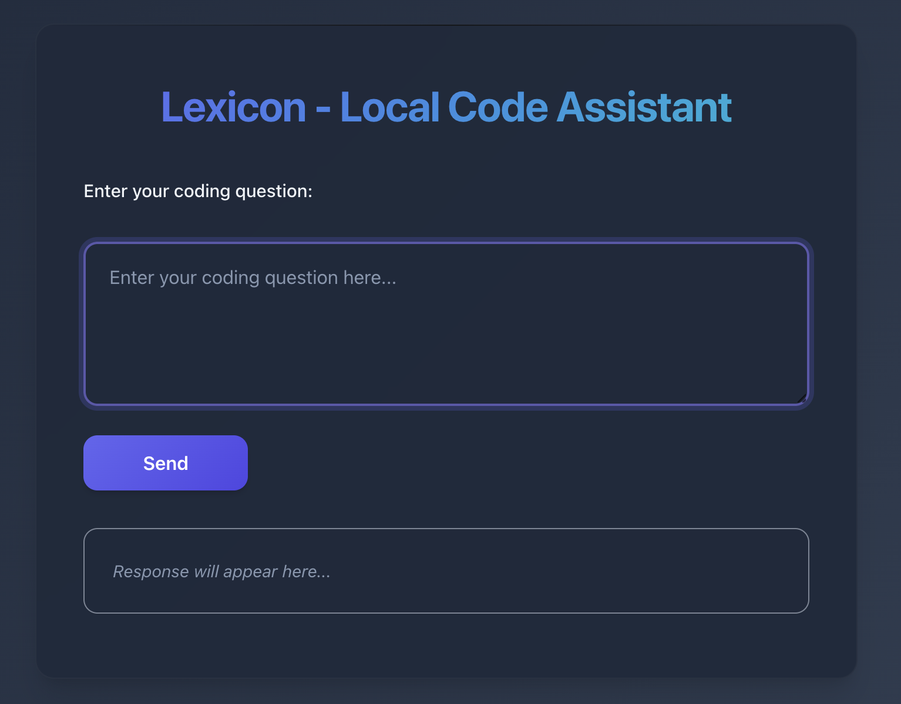

<p align="center">
  
</p>

# Lexicon

Lexicon is a portable, local-first code assistant that runs entirely from a USB stick using local LLMs. It does not
require internet access to provide syntax help, code explanations, and idiom translation across multiple programming
languages.

## Features

```
[Laptop] ----X---- [Internet]
    |
    ✓
[USB Drive/Ollama]
```
- Entirely offline operation
- Designed for privacy: no telemetry, no cloud calls
- Supports multiple programming languages
- Both command-line and web UI operation
- USB-based, self-contained environment
- Intended for use on macOS with Apple Silicon (M2+ recommended)

### Default Model: CodeLlama

Lexicon uses CodeLlama, a model optimized for code generation and explanation across multiple languages. Visit [Ollama's
model library](https://ollama.com/library) to browse other available models. You can use another model by swapping out
the model name anywhere that `codellama` is referenced in the procedure.


## Quick Start

See [Setup Procedure](#setup-procedure) for more detailed instructions.

1. Using macOS Disk Utility, format a USB drive as `APFS` and name it `LEXICON-USB`.

2. Clone this repository onto the USB:

    ```bash
    git clone https://github.com/JeannieFallon/lexicon /Volumes/LEXICON-USB/lexicon
    ```

3. Install Ollama on your Mac:

    ```bash
    brew install ollama
    ```

4. Add and update an Ollama environment file:

    ```bash
    vim /Volumes/LEXICON-USB/lexicon/config/ollama.env
    ```
    ```conf
    OLLAMA_MODELS=/Volumes/LEXICON-USB/lexicon/models
    OLLAMA_HOST=localhost:11434
    ```

5. Launch Lexicon, which will start the Ollama server:

    ```bash
    cd /Volumes/LEXICON-USB/lexicon && ./launch.sh
    ```

6. Download a model to the USB:

    ```bash
    ollama pull codellama
    ```

7. **CLI**: Run the following command to use Lexicon from the command line, fully offline. **Note**: wait for the `>>>` prompt to
    begin typing your question, and run `/?` to see available commands:

    ```bash
    ollama run codellama
    ```
    ```
    % ollama run codellama
        >>> /?
    Available Commands:
      /set            Set session variables
      /show           Show model information
      /load <model>   Load a session or model
      /save <model>   Save your current session
      /clear          Clear session context
      /bye            Exit
      /?, /help       Help for a command
      /? shortcuts    Help for keyboard shortcuts

    Use """ to begin a multi-line message.

    >>> Can you show me a for loop in Rust?

    Certainly! Here is an example of a `for` loop in Rust:

    fn main() {
        let numbers = vec![1, 2, 3, 4, 5];

        for number in numbers {
            println!("{}", number);
        }
    }

    This code will print the values of `numbers` to the console. The loop iterates over
    each value in the vector and prints it using the `println!` macro.

    You can also use a `for` loop to iterate . . .
    ```

 8. **Web UI**: Open the following in your web browser to use the Lexicon web interface, fully offline:

    ```
    http://localhost:8000
    ```

## System Requirements

Lexicon is designed to run from a USB drive on modern MacBooks with Apple Silicon and Metal acceleration.  Lexicon
requires macOS with Apple Silicon (M2+ recommended) for optimal Metal-accelerated inference. Internet connection needed
for initial setup only.

### Computer

- Hardware
  - Apple Silicon (M2 or later) with Metal acceleration
  - 16GB RAM minimum
- Operating System
  - macOS 13+ (Ventura or later)


To check for Metal support, run:

```bash
system_profiler SPDisplaysDataType | grep Metal
```

Verify output similar to the following:

```bash
Metal Support: Metal 3
```

### USB or SSD Drive

- 256GB+ recommended (128GB minimum for a single 7B model, tooling, and cache)
- USB 3.2 Gen 1 or better (supports ≥400MB/s read speeds)
- USB-C connection for easiest use on modern Apple products

**Drive types:**

- *Budget option*: High-speed USB-C flash drive (e.g., SanDisk Ultra Luxe)
- *Performance option*: Portable SSD (e.g., Samsung T7 Shield with ~1050MB/s)

**Note**: Slower drives may bottleneck model load times or impact performance during inference.

## Setup Procedure

### Online Setup

This first section is one-time setup that requires internet access to download various components.

#### Prepare the USB Drive

1. Insert your USB flash drive.
2. Open **Disk Utility** (Applications > Utilities).
3. In the *View* menu, select *Show All Devices*. This is critical to ensure that you can select the *entire device* and not just a single volume.
4. In the left sidebar group labeled *External*, select the *top-level USB device* (not the indented volume beneath it).
5. Click **Erase** and choose one of the following options:

   - **For macOS-only use (recommended):**
     - Name: `LEXICON-USB`
     - Format: `APFS`
     - Scheme: `GUID Partition Map`

   - **For cross-platform use (if you want to use the USB key on a Windows or Linux system):**
     - Name: `LEXICON-USB`
     - Format: `exFAT`
     - Scheme: `GUID Partition Map`

6. Click **Erase** and wait for the process to complete.

**Note**: if APFS doesn’t appear as an option, try these steps:
- First erase the device as **Mac OS Extended (Journaled)** with **GUID Partition Map**.
- Then immediately erase it again — APFS will now become selectable.

This ensures your USB has a modern GUID partition map and supports APFS formatting fully.

#### Clone the Project

- Move to the USB drive:
```bash
cd /Volumes/LEXICON-USB
```
- Clone this project:
```bash
git@github.com:JeannieFallon/lexicon.git && cd lexicon
```

#### Install Ollama Runtime (One-Time Host Setup)

- In another terminal pane, use [Homebrew](https://formulae.brew.sh/formula/ollama) to install Ollama on your computer:
```bash
brew install ollama
```
```
% ollama -h
Large language model runner

Usage:
  ollama [flags]
  ollama [command]

Available Commands:
  serve       Start ollama
  create      Create a model from a Modelfile
  show        Show information for a model
  run         Run a model
  stop        Stop a running model
  pull        Pull a model from a registry
  push        Push a model to a registry
  list        List models
  ps          List running models
  cp          Copy a model
  rm          Remove a model
  help        Help about any command

Flags:
  -h, --help      help for ollama
  -v, --version   Show version information
```

#### Pull a Model to the USB

- Create an Ollama configuration file:

```bash
vim /Volumes/LEXICON-USB/lexicon/config/ollama.env
```

- Add the following two key-value pairs to set the model storage path and the web app port:

```bash
OLLAMA_MODELS=/Volumes/LEXICON-USB/lexicon/models
OLLAMA_HOST=localhost:11434
```

- Start the Ollama server. If this is the first time running the server, you should see it generatea a new private key in `$HOME/.ollama`:
 ```bash
ollama serve
```

- In another terminal pane on your computer, use Ollama to download a quantized model[^1] onto the USB drive:
```bash
ollama pull codellama
```

- To confirm that the model has downloaded onto the USB drive, check its disk usage. You should see around 4GB in the `models/` directory:
```
% du -sh /Volumes/LEXICON-USB/lexicon/models/
3.8G    /Volumes/LEXICON-USB/lexicon/models/
```

### Offline Usage

From this point on, no internet access is required. **Note**: you will need internet access to download and use additional models.

#### Launch Lexicon

- Inside the Lexicon project, run the following script to start Ollama and serve the Lexicon web interface:
```bash
cd /Volumes/LEXICON-USB/lexicon
```
```bash
./launch.sh
```
- Open the following in your web browser to use the Lexicon web interface, fully offline:
```
http://localhost:8000
```

## Notes

- Lexicon is optimized for MacBooks with M2 or newer chips (Metal acceleration).
- Once models are downloaded, Lexicon requires no internet to run.
- You can add more models or prompts later to expand its capabilities.

## References

- [Ollama Runtime](https://ollama.com)
- [Ollama Docs](https://ollama.com/library)
- [Available Models](https://ollama.com/library)
- [Ollama GitHub (Open Source)](https://github.com/ollama/ollama)
- [Apple Disk Utility Guide](https://support.apple.com/guide/disk-utility/erase-and-reformat-storage-devices-dskutl14079/mac)
- [Apple Metal Acceleration](https://developer.apple.com/metal/)

## License

MIT. See `LICENSE` file for full terms.

[^1]: *Quantized models* are smaller, optimized versions of large language models. Instead of storing all weights in full precision
(like 16 or 32 bits), quantized models use lower precision (like 4 or 8 bits), drastically reducing file size and memory requirements.
This makes them much more practical to run locally on consumer hardware without losing much accuracy in responses. For a technical
introduction, see [Hugging Face's guide to model quantization](https://huggingface.co/docs/transformers/perf_train_gpu_one#model-quantization).

