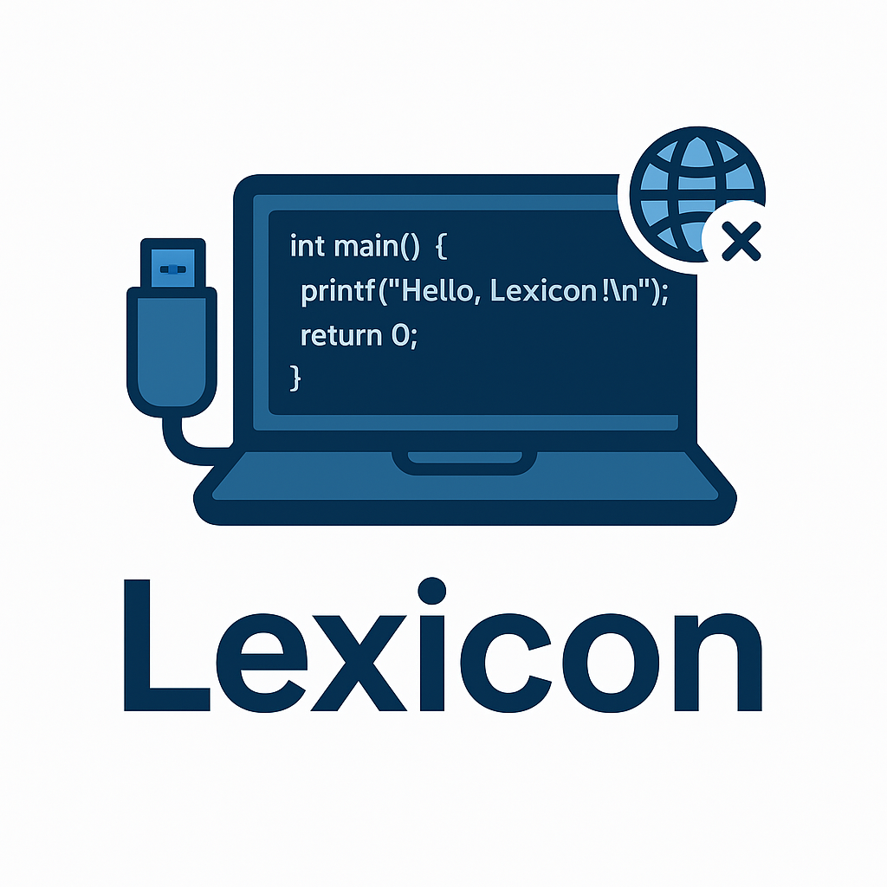

# Lexicon

Lexicon is a portable, local-first code assistant that runs entirely from a USB stick using local LLMs. It does not
require internet access to provide syntax help, code explanations, and idiom translation across multiple programming
languages.

<p align="center">
  
</p>

## Features

```
[Laptop] ----X---- [Internet]
    |
    ✓
[USB Drive/Ollama]
```
- Entirely offline operation
- Designed for privacy: no telemetry, no cloud calls
- Supports multiple programming languages
- Simple, static web UI for interaction
- USB-based, self-contained environment

## System Requirements

Lexicon requires macOS with Apple Silicon (M2+ recommended) for optimal Metal-accelerated inference. Internet connection
needed for initial setup only.

## Quick Start

See documentation for more detailed instructions.

1. Format a USB drive as `exFAT` and name it `LEXICON-USB`.

2. Clone this repository onto the USB:

    ```bash
    git clone https://github.com/your-username/lexicon /Volumes/LEXICON-USB/lexicon
    ```

3. Install Ollama on your Mac:

    ```bash
    brew install ollama
    ```

4. Pull a model into the USB (example: Mistral):

    ```bash
    export OLLAMA_MODELS=/Volumes/LEXICON-USB/lexicon/models
    ```
    ```bash
    ollama pull mistral
    ```

5. Launch Lexicon:

    ```bash
    cd /Volumes/LEXICON-USB/lexicon
    ```
    ```bash
    ./bin/launch.sh
    ```

## Project Structure

- `bin/` – Executable scripts (launch, install, health checks)
- `config/` – Local environment and configuration files
- `models/` – Downloaded model files (large, not tracked in Git)
- `webui/lexicon/` – Static web UI (HTML, JS, CSS)
- `README.md` – Project overview and quick start instructions

## Documentation

See `docs/` for more information:
- `setup.md` – Full installation and configuration instructions
- `privacy.md` – Offline verification and network blocking
- `model-guide.md` – Suggested models and language support

## License

MIT. See `LICENSE` file for full terms.
